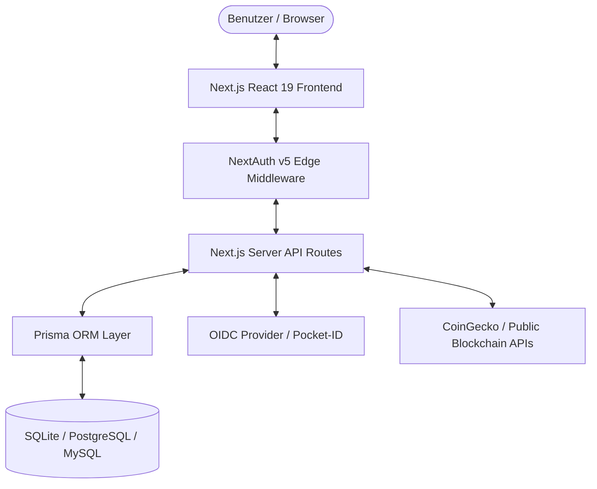

# 🛡️ Technische Systemdokumentation & Technisch-Organisatorische Maßnahmen (TOM)
> **Gemäß Art. 32 DSGVO (Sicherheit der Verarbeitung)**
> **Anwendung:** CryptoTracker Portfolio & Tax Management Application  
> **Version:** 0.3.0  
> **Stand:** August 2026  

---

## 📋 INHALTSVERZEICHNIS

1. [TEIL A: TEKNISCHE SYSTEMDOKUMENTATION](#-teil-a-technische-systemdokumentation)
   - 1.1 Systemarchitektur & Tech-Stack
   - 1.2 Datenmodell & Datenhaltung
   - 1.3 Authentifizierung & Rechteverwaltung
   - 1.4 Externe Schnittstellen & Datenfluss
2. [TEIL B: TECHNISCH-ORGANISATORISCHE MASSNAHMEN (TOM) GEMÄSS ART. 32 DSGVO](#-teil-b-technisch-organisatorische-massnahmen-tom-gemäss-art-32-dsgvo)
   - 2.1 Vertraulichkeit (Art. 32 Abs. 1 lit. b DSGVO)
   - 2.2 Integrität (Art. 32 Abs. 1 lit. b DSGVO)
   - 2.3 Verfügbarkeit & Belastbarkeit (Art. 32 Abs. 1 lit. b & c DSGVO)
   - 2.4 Verfahren zur regelmäßigen Überprüfung & Evaluierung (Art. 32 Abs. 1 lit. d DSGVO)

---

## 🏗️ TEIL A: TECHNISCHE SYSTEMDOKUMENTATION

### 1.1 Systemarchitektur & Tech-Stack

CryptoTracker ist eine selbst-gehostete Full-Stack-Webanwendung auf Basis des Next.js-Frameworks.

* **Frontend Framework:** Next.js 15 (React 19, TypeScript, Vanilla CSS Design System).
* **Backend Runtime:** Node.js 22 LTS (mit Next.js Server Components & API Routes).
* **ORM & Datenbank-Layer:** Prisma ORM 6.x mit Unterstützung für:
  * SQLite (embedded, dateibasiert: `cryptotracker.db`)
  * PostgreSQL (externer Datenbank-Server)
  * MySQL / MariaDB (externer Datenbank-Server)
* **Authentifizierung:** NextAuth.js v5 (JWT & Datenbank-Sessions) + OIDC / OAuth2 Client.
* **Containerisierung:** Docker & Docker Compose (Multi-stage Alpine Linux Container).

---

### 1.2 Datenmodell & Datenhaltung

Die Anwendung verarbeitet folgende Datenkategorien:

1. **Stammdaten / Benutzerkonto (`User`, `Account`, `Session`):**
   * Name, E-Mail-Adresse, gehakter Passwort-Hash (bcrypt).
   * OIDC-Protokolldaten (Subject ID, Provider Token).
2. **Finanz- & Transaktionsdaten (`Transaction`, `Asset`, `Wallet`):**
   * Kryptowährungs-Käufe, Verkäufe, Swaps, Staking-Rewards, Gebühren.
   * Anschaffungskosten, Anschaffungsdaten, Haltefristen (§ 23 EStG).
   * Wallet-Adressen (Public Keys).
3. **Systemkonfiguration (`OidcSettings`, `DbConfig`):**
   * OIDC Issuer URLs, Client IDs (Verschlüsselt/Geschützt).
   * Externe Datenbank-Verbindungsdaten.

---

### 1.3 Authentifizierung & Rechteverwaltung

* **Lokale Authentifizierung:** Passwort-Hashing via `bcrypt` mit hohem Salt-Runden-Faktor (12+).
* **Single Sign-On (SSO):** OIDC Authorization Code Flow mit PKCE (Proof Key for Code Exchange) und `state`-Validierung gegen CSRF-Angriffe.
* **Session-Management:** Kryptographisch signierte HTTP-Only SameSite Cookies zur Verhinderung von XSS- und CSRF-Session-Hijacking.
* **Zugriffskontrolle:** Middleware-gestützte Routen-Protektion (`middleware.ts`) sperrt alle `/dashboard`-, `/steuern`-, `/nfts`- und `/einstellungen`-Routen für unauthentifizierte Anfragen.

---

### 1.4 Externe Schnittstellen & Datenfluss

* **Preis- & Kursdaten:** Abfrage öffentlicher REST-APIs (z. B. CoinGecko API) ohne Übermittlung personenbezogener Benutzerdaten.
* **Blockchain-Explorer:** Abfrage öffentlicher Transaktionsdaten anhand von Public Wallet Adressen.
* **OIDC-Provider:** Lokale/interne Kommunikation mit IdPs (z. B. Pocket-ID, Keycloak).

---

## 🔒 TEIL B: TECHNISCH-ORGANISATORISCHE MASSNAHMEN (TOM) GEMÄSS ART. 32 DSGVO

### 2.1 Vertraulichkeit (Art. 32 Abs. 1 lit. b DSGVO)

#### a) Zutrittskontrolle
* Die Anwendung wird selbst-gehostet (Self-Hosted On-Premise oder auf eigenen Virtual Private Servern).
* Der physikalische Zutritt zu den Servern unterliegt den Sicherheitsmaßnahmen des gewählten Rechenzentrumsanbieters bzw. der eigenen IT-Infrastruktur des Betreibers.

#### b) Zugangskontrolle (Systemzugang)
* Authentifizierungspflicht für alle Administratoren und Benutzer.
* Erzwungene Passwortkomplexität und Unterbindung unverschlüsselter Übertragungen.
* Unterstützung von zentraler Mehrfaktor-Authentifizierung (MFA/2FA) über OIDC-Identity-Provider (z. B. Pocket-ID, Keycloak).

#### c) Zugriffskontrolle (Datenzugriff)
* Rollen- und benutzerbasierte Datentrennung: Jeder Benutzer sieht ausschließlich seine eigenen Transaktions- und Portfolio-Daten.
* Das Datenbank-Schema erzwingt Mandantentrennung auf Abfrageebene (`userId` Foreign Key Constraints).

#### d) Trennungskontrolle
* Test- und Entwicklungsumgebungen sind strikt von der Produktivumgebung getrennt.
* Entwicklungsdaten enthalten keine Echtdaten aus der Produktivdatenbank.

#### e) Pseudonymisierung & Verschlüsselung (Art. 32 Abs. 1 lit. a DSGVO)
* **Encryption in Transit:** Alle Webverbindungen werden zwingend über HTTPS / TLS 1.3 verschlüsselt.
* **Encryption at Rest:** Passwörter werden mittels Einweg-Hashing (bcrypt) gespeichert. Datenbankverbindungen zu externen Servern (PostgreSQL/MySQL) nutzen SSL/TLS-Verschlüsselung (`sslmode=require`).

---

### 2.2 Integrität (Art. 32 Abs. 1 lit. b DSGVO)

#### a) Weitergabekontrolle
* Personengebundene Daten werden weder an Dritte noch an externe Tracking-Dienste übermittelt.
* Es sind keine Drittanbieter-Analyse-Scripts (z. B. Google Analytics) eingebunden.

#### b) Eingabekontrolle
* Nachvollziehbarkeit von Datenänderungen durch Zeitstempel (`createdAt`, `updatedAt`) bei allen Transaktions- und Benutzerdaten-Sätzen.
* Formular-Eingaben werden sowohl client- als auch serverseitig strikt auf Datentypen und Längen geprüft.

---

### 2.3 Verfügbarkeit & Belastbarkeit (Art. 32 Abs. 1 lit. b & c DSGVO)

#### a) Verfügbarkeitskontrolle
* Bei Docker-Deployments sorgen Auto-Restart Policies (`restart: unless-stopped`) für die automatische Wiederherstellung bei Abstürzen.
* Entkoppelte Architektur: Ausfälle externer Kurs-APIs führen nicht zum Absturz der Kernanwendung.

#### b) Rasche Wiederherstellbarkeit (Disaster Recovery)
* Datenbank-Backups können durch einfachen Export der SQLite-Datei (`cryptotracker.db`) oder Standard-Dump-Tools (PostgreSQL `pg_dump`, MySQL `mysqldump`) durchgeführt werden.
* Automatische Datenbankschema-Synchronisierung via Prisma ORM (`npx prisma db push`).

---

### 2.4 Verfahren zur regelmäßigen Überprüfung & Evaluierung (Art. 32 Abs. 1 lit. d DSGVO)

#### a) Datenschutz- & Sicherheits-Management
* Regelmäßige Aktualisierung der Abhängigkeiten zur Vermeidung bekannter Sicherheitslücken in Open-Source-Paketen.
* Quellcode-Qualitätssicherung durch automatisiertes TypeScript-Build-Checking (`npx tsc --noEmit`) und Linter.

#### b) Incident Management & Protokollierung
* Systemereignisse und API-Fehler werden serverseitig ohne Protokollierung sensibler Klartext-Passwörter oder Tokens geloggt.
* Im Falle von Sicherheitsupdates wird die Anwendung über das integrierte Kanal-Update-System (`main` / `beta`) umgehend aktualisiert.

---

*Dokument-Ende — Technische Systemdokumentation & TOM gemäß Art. 32 DSGVO*
